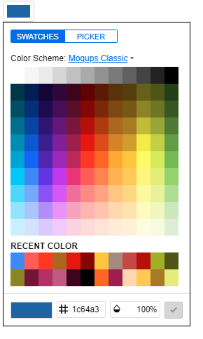

# ColorPicker

```js
   var picker =  absol._({
        tag: 'solidcolorpicker',// tagName of default color picker
        props: {
            value: 'black',// support rgb, rgba, hsl,hsla, hsb, hsba, hex8, hex6, hex4, hex3
        }
    }).on('change', function (event, sender) {
        mEditableText.addStyle('background-color', event.value.getContrastYIQ().toString())
        mEditableText.addStyle('color', event.value.toString());
    });
    document.body.appendChild(picker);

```


```js
    var cButton = absol._({
            tag: 'colorpickerbutton',
            on:{
                change: function(event)
                {
                    
                    mEditableText.addStyle('background-color', event.value.getContrastYIQ().toString())
                    mEditableText.addStyle('color', event.value.toString());
                }
            },
            props: {
                value: "#1c64a3",
            }
        }).addTo(document.body);
    document.body.appendChild(cButton);
```

[](https://absol.cf/colorpicker)