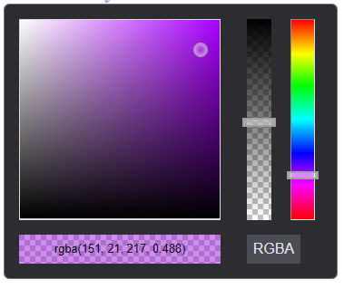

# ColorPicker

```js
    //ColorPicker is a object
    ColorPicker._({
            tag: 'colorpicker',// tagName of default color picker
            props: {
                value: 'black',// support rgb, rgba, hsl,hsla, hsb, hsba, hex8, hex6, hex4, hex3
                mode:'RGBA'// HSB|HSL|RGB|RGBA|HSBA|HSLA
            }
        }).on('change', function (event, sender) {
            mEditableText.addStyle('background-color', this.value.getContrastYIQ().toString())
            mEditableText.addStyle('color', this.value.toString());
        }).addTo(document.body);

```


```js
    absol._({
            tag: 'colorpickerbutton',
            on:{
                change: function(event)
                {
                    
                    mEditableText.addStyle('background-color', event.value.getContrastYIQ().toString())
                    mEditableText.addStyle('color', event.value.toString());
                }
            },
            props: {
                value: "#1c64a3",
                mode:'RGBA'
            },
        }).addTo(document.body);
```

[](https://volcanion.cf/colorpicker)